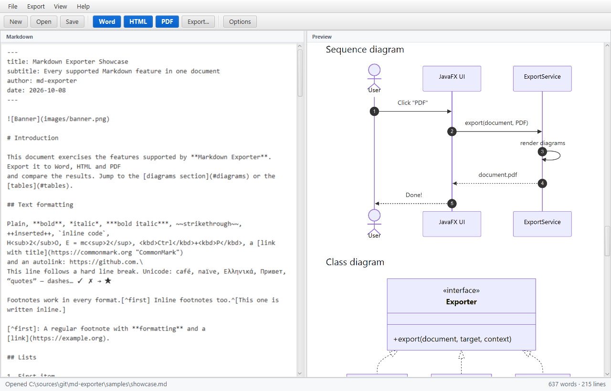
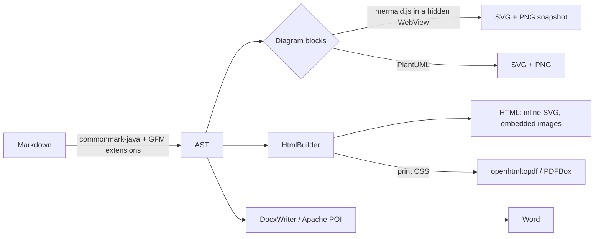

# Markdown Exporter

A JavaFX 21 desktop application (plus a command line mode) that exports Markdown documents to **Word (.docx)**,
**HTML** and **PDF**, including diagrams, tables, images and footnotes.



## Features

| Markdown feature                                  | Word | HTML | PDF |
|---------------------------------------------------|:----:|:----:|:---:|
| Headings, emphasis, strikethrough, `++ins++`      |  ✓   |  ✓   |  ✓  |
| Links (external and `#heading` anchors)           |  ✓   |  ✓   |  ✓  |
| Ordered / bullet / nested / task lists            |  ✓   |  ✓   |  ✓  |
| Tables with column alignment                      |  ✓   |  ✓   |  ✓  |
| Images (PNG, JPEG, GIF, BMP, SVG, remote, data:)  |  ✓   |  ✓   |  ✓  |
| Image size `{width=200}`               |  ✓   |  ✓   |  ✓  |
| Code blocks, block quotes, GitHub alerts          |  ✓   |  ✓   |  ✓  |
| Footnotes (`[^1]` and inline `^[...]`)            |  ✓ (real Word footnotes) | ✓ | ✓ |
| **Mermaid** diagrams (` ```mermaid `)             |  ✓   |  ✓ (inline SVG) | ✓ |
| **PlantUML** diagrams (` ```plantuml ` / `puml`)  |  ✓   |  ✓ (inline SVG) | ✓ |
| Graphviz (` ```dot `, needs Graphviz installed)   |  ✓   |  ✓   |  ✓  |
| YAML front matter (`title`, `subtitle`, `author`, `date`) | title block + document properties | ✓ | ✓ |
| Table of contents (option)                        | Word TOC field | ✓ | ✓ with page numbers |
| Simple inline HTML (`<br>`, `<sub>`, `<sup>`, `<kbd>`, ``) | ✓ | ✓ | ✓ |

The application window shows **one tab per document**, each with a Markdown editor and a **live preview**.
Open several files at once (multi-select in *Open…*, drag & drop, or several file names on the command
line); the built-in feature showcase opens in its own tab next to your files (**Showcase** button /
*Help → Feature Showcase*). Opening a file that is already open selects its tab. Tabs can be reordered by
dragging and have a context menu (*Close*, *Close Others*, *Close All*, *Show in Folder*); unsaved tabs ask
before closing. Exports always apply to the selected tab.

| Shortcut | Action |
|---|---|
| `Ctrl+N` / `Ctrl+O` | new document / open files (each in a new tab) |
| `Ctrl+S` / `Ctrl+Shift+S` / `Ctrl+Alt+S` | save / save as / save all |
| `Ctrl+W` / `Ctrl+Shift+W` | close tab / close all tabs |
| `Ctrl+Tab`, `Ctrl+PgDn` / `Ctrl+PgUp` | next / previous tab |
| `Ctrl+Shift+D` / `Ctrl+Shift+H` / `Ctrl+Shift+P` | export to Word / HTML / PDF |
| `Ctrl+E` | export to several formats |
| `F5` | re-render the previews (clears the diagram cache) |

Export options (page size, orientation, margins, table of contents, Mermaid theme, diagram resolution,
embedded or copied HTML images) and recent files are remembered between sessions.

## Requirements

* JDK 21 or newer (tested with Temurin 21.0.11)
* Maven 3.9+
* JavaFX **21.0.12** is pulled from Maven Central automatically (the platform specific artifacts are
  selected by the OpenJFX POMs).

No other installation is needed: Mermaid is rendered with `mermaid.min.js` from the
[`org.webjars.npm:mermaid`](https://central.sonatype.com/artifact/org.webjars.npm/mermaid) WebJar inside a hidden
JavaFX `WebView` (upgrade it by changing `mermaid.version` in `pom.xml`), and PlantUML is pure Java (layouts use PlantUML's built-in *Smetana* engine when
Graphviz is not installed). Only ` ```dot ` blocks require a Graphviz installation (`dot` on the `PATH`
or the `GRAPHVIZ_DOT` environment variable).

## Build & run

```bash
mvn javafx:run
```

```bash
mvn clean package
```

`mvn package` runs the tests and produces a self-contained jar for the current platform:

```bash
java -jar target/md-exporter-1.0.0-SNAPSHOT-all.jar
```

### Windows executable

`scripts/build-exe.cmd` (or `scripts/build-exe.ps1`) builds the jar and packages it with the JDK's
`jpackage` and a trimmed Java runtime, so end users need no Java installation. Output goes to `target/dist`.

```bash
scripts/build-exe.cmd
```

| Command | Result | Extra requirement |
|---|---|---|
| `build-exe.cmd` | portable folder `Markdown Exporter\` with `Markdown Exporter.exe` (GUI) and `md-exporter-cli.exe` (console), plus a `.zip` of it | none |
| `build-exe.cmd -Type exe` | setup `.exe`: per-user install (no admin), Start menu + desktop shortcut, `.md` file association | [WiX Toolset 3.x](https://github.com/wixtoolset/wix3/releases) (`winget install WiXToolset.WiXToolset`) |
| `build-exe.cmd -Type msi` | the same as an `.msi` package | WiX Toolset 3.x |
| `build-exe.cmd -Type all` | all of the above | WiX Toolset 3.x |

Options: `-SkipTests`, `-NoBuild` (reuse the existing jar), `-FullRuntime` (bundle every JDK module
instead of the trimmed list, if a feature ever reports a missing class). The portable folder is about
165 MB (140 MB zipped). Installers keep a fixed upgrade code, so a newer installer replaces the old version.

### Command line

Any option switches to batch mode (the JavaFX toolkit is still used, invisibly, to render Mermaid):

```bash
java -jar target/md-exporter-1.0.0-SNAPSHOT-all.jar --export -f docx,pdf -o out --toc samples/showcase.md
```

| Option | Description |
|---|---|
| `-x`, `--export` | export the given files |
| `-f`, `--format <list>` | `docx`, `html`, `pdf` (comma separated, default: all) |
| `-o`, `--output <dir>` | output folder (default: next to each input file) |
| `-p`, `--page-size <size>` | `A4` (default), `A5`, `Letter`, `Legal` |
| `--landscape`, `--margin <mm>` | page orientation and margins |
| `--toc` | insert a table of contents |
| `--no-embed` | HTML: copy images to `<name>_files/` instead of embedding them |
| `--theme <name>` | Mermaid theme: `default`, `neutral`, `forest`, `dark`, `base` |
| `--scale <n>` | diagram/SVG raster resolution for Word and PDF (default `2`) |

Add `-Dmdx.debug=true` to print stack traces on failures.

## How it works



| Package | Content |
|---|---|
| `io.mdexporter.core` | parsing (`MarkdownParser`), options, image loading/rasterisation, `ExportService` |
| `io.mdexporter.diagram` | `DiagramService` (cache + dispatch), `MermaidRenderer`, `PlantUmlRenderer` |
| `io.mdexporter.export` | `HtmlBuilder` (preview/HTML/PDF), `HtmlExporter`, `PdfExporter`, `DocxExporter`/`DocxWriter` |
| `io.mdexporter.ui` | JavaFX main window, export dialog, options, persisted settings |

Notes:

* Word output uses real Word styles (`Heading 1…6`, `Quote`, `Source Code`, `Table Text`, …), numbering
  definitions and bookmarks, so the navigation pane, TOC and restyling work as usual.
  When a table of contents is requested, Word asks to update fields when the document is opened.
* PDF output embeds system fonts (Segoe UI/Consolas on Windows, DejaVu/Liberation on Linux, Arial/Courier
  on macOS) for proper Unicode support, has PDF bookmarks and page numbers.
* Mermaid uses HTML labels (`foreignObject`), which SVG rasterisers do not support; that is why Word/PDF
  get a high resolution `WebView` snapshot while HTML keeps the vector SVG.
* The self-contained jar bundles the JavaFX natives of the build platform; build it on each target OS.

## Tests

```bash
mvn test
```

The tests export a sample document to all three formats and inspect the results with POI / PDFBox.
They use PlantUML only, so they run headless (Mermaid needs a display for the `WebView`).
`samples/showcase.md` exercises every feature and is a good manual test.
