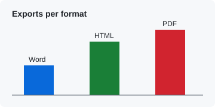
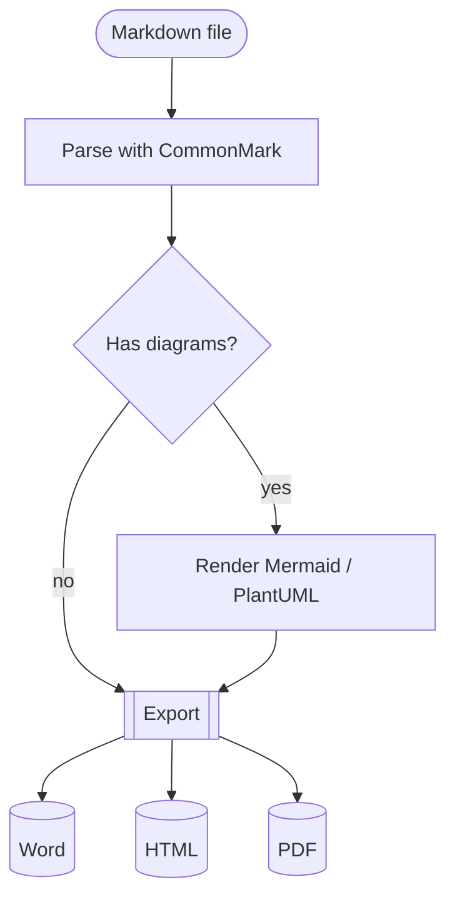
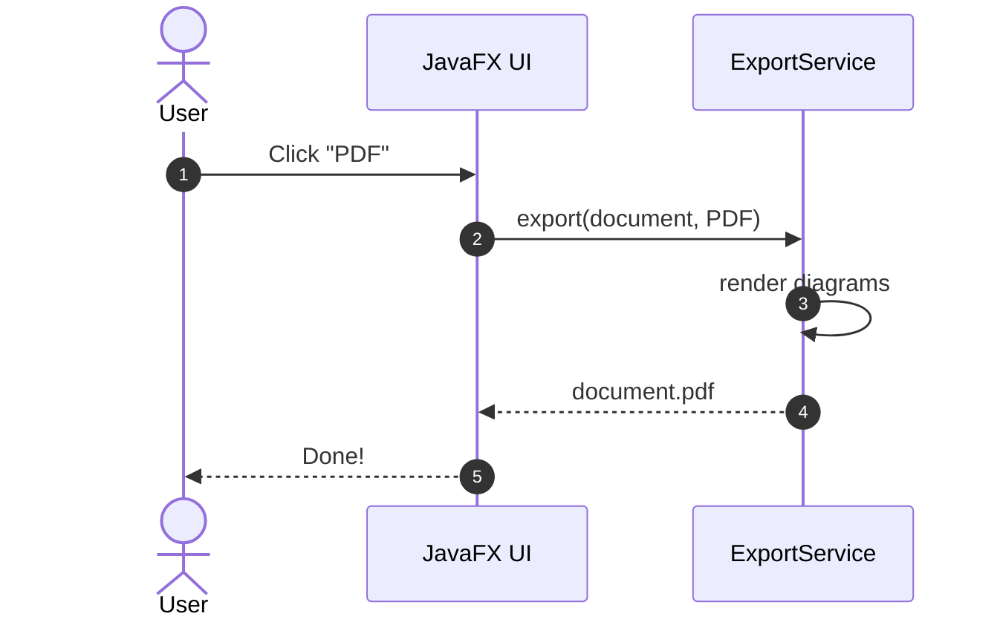
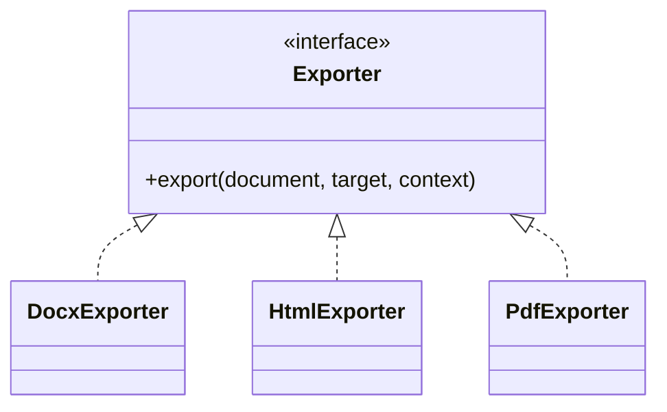
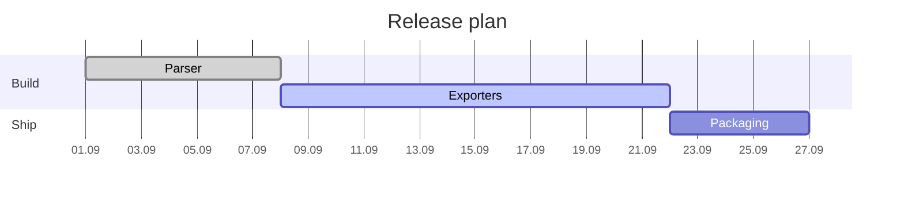
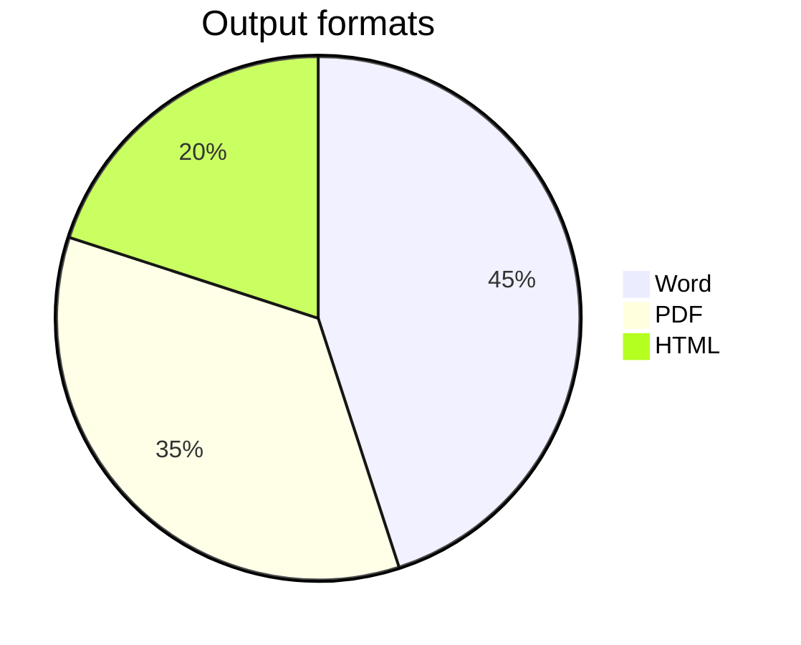
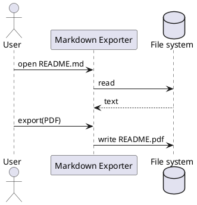
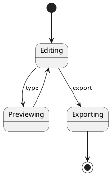

# Introduction

This document exercises the features supported by **Markdown Exporter**. Export it to Word, HTML and PDF
and compare the results. Jump to the [diagrams section](#diagrams) or the [tables](#tables).

## Text formatting

Plain, **bold**, *italic*, ***bold italic***, ~~strikethrough~~, ++inserted++, `inline code`,
H<sub>2</sub>O, E = mc<sup>2</sup>, <kbd>Ctrl</kbd>+<kbd>P</kbd>, a [link with title](https://commonmark.org "CommonMark")
and an autolink: https://github.com.\
This line follows a hard line break. Unicode: café, naïve, Ελληνικά, Привет, “quotes” — dashes… ✓ ✗ → ★

Footnotes work in every format.[^first] Inline footnotes too.^[This one is written inline.]

[^first]: A regular footnote with **formatting** and a [link](https://example.org).

## Lists

1. First item
2. Second item with a continuation paragraph.

   This paragraph belongs to the second item.
3. Third item
   - nested bullet
   - another nested bullet
     1. deeper numbered
     2. deeper numbered again
4. Fourth item

Ordered list starting at 7:

7. seven
8. eight

Task list:

- [x] Parse Markdown
- [x] Render diagrams
- [ ] Take over the world

## Quotes and alerts

> A block quote with *emphasis*.
>
> > A nested quote.

> [!NOTE]
> Useful information that users should know, even when skimming content.

> [!TIP]
> Helpful advice for doing things better or more easily.

> [!IMPORTANT]
> Key information users need to know to achieve their goal.

> [!WARNING]
> Urgent info that needs immediate user attention to avoid problems.

> [!CAUTION]
> Advises about risks or negative outcomes of certain actions.

## Tables

| Left aligned | Centered | Right aligned | Notes                                  |
|:-------------|:--------:|--------------:|----------------------------------------|
| Apples       |    3     |         1.20 | Fresh from the **orchard**             |
| Bananas      |    12    |        14.40 | `inline code` in a cell                |
| Cherries     |   250    |         62.50 | A [link](https://example.org) in a cell |
| Total        |          |     **78.10** |                                        |

## Images

A PNG image with a specified width: {width=240}

An SVG image (rasterised for Word and PDF):



<p align="center">
  
</p>

A missing image is reported instead of failing the export: 

## Diagrams

### Flowchart



### Sequence diagram



### Class diagram



### Gantt chart



### Pie chart



### PlantUML





### Invalid diagram

Errors are shown in the output rather than aborting the export:

```mermaid
flowchart LR
    A --> 
```

## Code

```java
public final class Hello {
    public static void main(String[] args) {
        System.out.println("Hello, world!");	// tab before comment
    }
}
```

```json
{ "name": "md-exporter", "formats": ["docx", "html", "pdf"] }
```

    Indented code block
    (four spaces)

---

The end.
