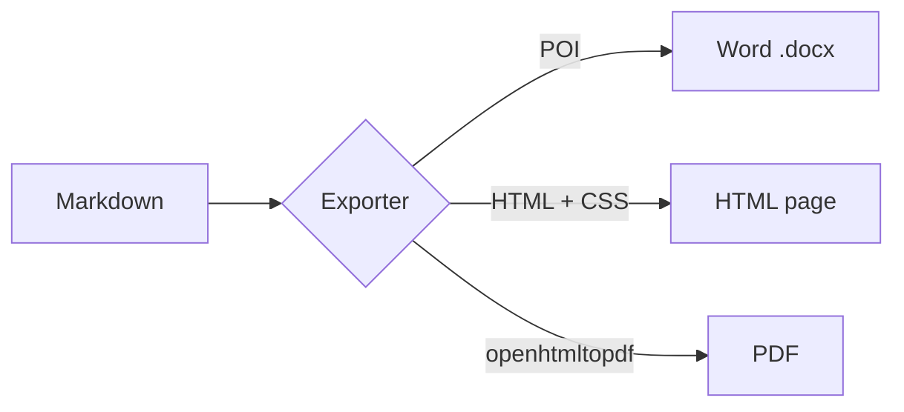
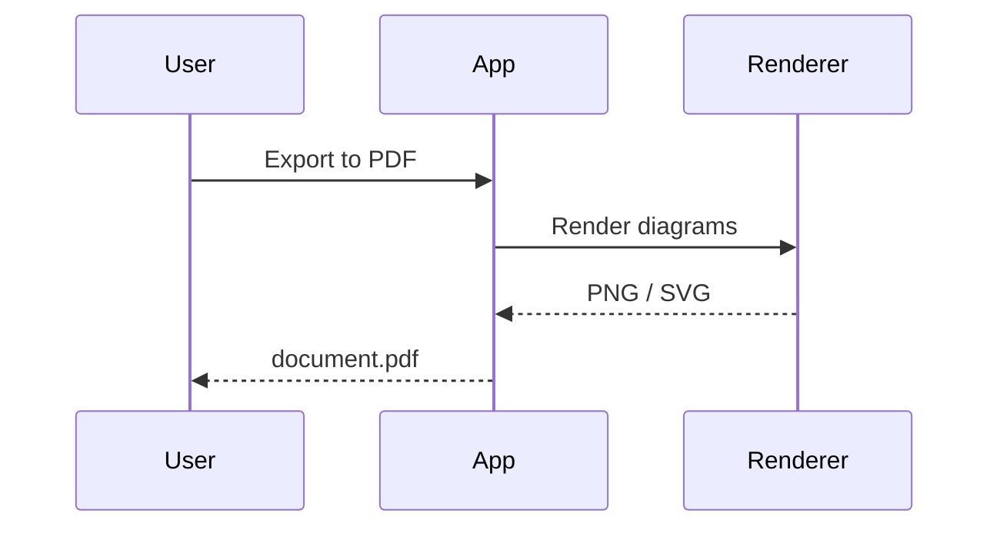
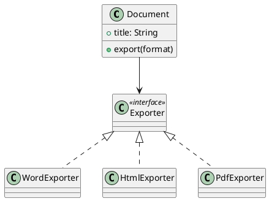

# Getting started

Type Markdown on the left, the preview on the right updates as you type.
Use the **Word**, **HTML** and **PDF** buttons (or the *Export* menu) to export the document.
Open or drop `.md` files onto the window: each one gets its own tab, next to this showcase
(reopen it any time with the **Showcase** button). Relative image paths are resolved against each file's folder.

> [!TIP]
> *Export → Export Multiple Formats…* writes all formats in one go, and *Export Options…* sets the
> page size, margins, table of contents and Mermaid theme.

## Text formatting

Plain, **bold**, *italic*, ***both***, ~~strikethrough~~, ++inserted++, `inline code`,
H<sub>2</sub>O, E = mc<sup>2</sup>, <kbd>Ctrl</kbd>+<kbd>S</kbd> and a [link](https://commonmark.org).
URLs such as https://github.com are linked automatically. Footnotes are supported too.[^1]

[^1]: Footnotes become real footnotes in Word, and are collected at the end in HTML and PDF.

## Lists

1. First item
2. Second item
   - nested bullet
   - another one
     1. deeper numbered
3. Third item

- [x] Task done
- [ ] Task to do

## Table

| Feature        | Word | HTML | PDF |
|:---------------|:----:|:----:|:---:|
| Tables         |  ✓   |  ✓   |  ✓  |
| Images         |  ✓   |  ✓   |  ✓  |
| Mermaid        |  ✓   |  ✓   |  ✓  |
| PlantUML       |  ✓   |  ✓   |  ✓  |
| Footnotes      |  ✓   |  ✓   |  ✓  |

## Mermaid diagrams





## PlantUML diagram



## Code

```java
public record Greeting(String name) {
    public String text() {
        return "Hello, " + name + "!";
    }
}
```

## Alerts and quotes

> [!NOTE]
> Useful information that users should know.

> [!WARNING]
> Critical content demanding immediate user attention.

> Markdown is a lightweight markup language for creating formatted text.
> — *Wikipedia*

---

*Happy exporting!*
